<div align="center">

# Kairav&nbsp;Dutta

### `I write the layer underneath.`

<sub>BTech CSE · IIIT Delhi · class of&nbsp;`'29` · 18 · runs on `make -j$(nproc)`</sub>

<br>

[](https://ka1rav6.github.io/)
[](mailto:kairavdutta@gmail.com)
[](https://www.linkedin.com/in/kairavdutta)

<br>

```console
$ file $(which kairav)
kairav: ELF 64-bit LSB executable, x86-64, dynamically curious,
        statically linked against C, interpreter /lib/ld-coffee.so

$ kairav --version
kairav 18.0.0 (build iiitd-cse-2029)
origin   : competitive programming → systems → graphics → ML infra
linked   : C11 · C++20 · Zig · Python · TypeScript · x86-64 asm
warnings : 1 (grass_touching.service inactive)
```

</div>

---

## `$ whoami`

<table>
<tr>
<td width="42%" valign="top">

<!-- swap to assets/avatar-ascii.svg for the glyph version — see explain.md -->


</td>
<td valign="top">

I came in through competitive programming and stayed for everything sitting under it — allocators, bytecode, sockets, gap buffers, shader pipelines, build graphs. Most of what I build is a thing I could have installed, written badly on purpose first, so I'd know what the good version was actually doing.

The other half of me just wants pixels on screen and a game loop that hits frame time.

The portrait decodes itself on every page load — no JavaScript, because GitHub strips it. [It's an SVG](assets/avatar-blocks.svg) whose rows fade in on staggered CSS delays, [generated from my avatar](tools/ascii_avatar.py).

</td>
</tr>
</table>

> [!NOTE]
> **Written instead of installed:** a build system, a rule engine, a tensor library,
> an HTTP server, a logging library, a GUI toolkit, a text editor, and a language.

---

## `$ tree ~/stack`

Where my repos actually live, top to bottom:

```
┌─ user ──────────────────────────────────────────────────────┐
│  games & apps       ctf-game · tetris · doodle-jump · gmtk  │
├─ tooling ───────────────────────────────────────────────────┤
│  build & codegen    pico · lazycmake · copa · K             │
├─ runtime ───────────────────────────────────────────────────┤
│  engines & VMs      vela (bytecode VM) · game_server        │
├─ library ───────────────────────────────────────────────────┤
│  primitives         zcore (tensors) · logx · ezui           │
├─ syscall ───────────────────────────────────────────────────┤
│  raw interfaces     http-server (sockets) · textmex (tty)   │
└─────────────────────────────────────────────────────────────┘
   ▲ I keep drifting down this stack. It hasn't stopped yet.
```

---

## `$ ls ~/work --sort=interesting`

<table>
<tr>
<td width="50%" valign="top">

### [`vela`](https://github.com/ka1rav6/vela)
Embeddable rule engine in C. JSON rules get **compiled to bytecode** and executed on a stack VM.

*Interesting because rules stop being an if-tree and become an instruction stream — arena allocator, bitmask fact storage, thread-safe, ships as `libvela.a`.*

`C11` `bytecode-vm` `CMake`

</td>
<td width="50%" valign="top">

### [`zcore`](https://github.com/ka1rav6/zcore)
A tensor library in Zig — storage / shape / stride primitives first, autograd on top.

*Interesting because the fastest way to understand ML infra is to rebuild the part everyone treats as a black box.*

`Zig` `SIMD` `autograd`

</td>
</tr>
<tr>
<td width="50%" valign="top">

### [`pico`](https://github.com/ka1rav6/pico)
A build system for C++. No CMake, no config file, no `CMakeLists.txt` archaeology.

*Interesting because it's the tool I got annoyed enough to replace — automatic dependency discovery and packaging, just `pico build`.*

`C++` `build-systems`

</td>
<td width="50%" valign="top">

### [`logx`](https://github.com/ka1rav6/logx)
One file. Ten languages. Zero dependencies. The same logging API, hand-ported to each.

*Interesting because holding one design honest across Python, JS/TS, C, C++, Rust, Go, Java, Zig and assembly forces you to see what's language and what's actually the idea.*

`C` `C++` `Rust` `Go` `Zig` `asm`

</td>
</tr>
<tr>
<td width="50%" valign="top">

### [`ctf-game`](https://github.com/ka1rav6/ctf-game)
3D capture-the-flag on OpenGL + GLFW, Assimp model loading, ReactPhysics3D, ImGui debug tooling.

*Interesting because gameplay is the easy part — the hard part is keeping physics bodies and render transforms in sync at 60fps.*

`C++20` `OpenGL` `physics`

</td>
<td width="50%" valign="top">

### [`K`](https://github.com/ka1rav6/K)
A language that transpiles to C++ — nicer syntax and error messages, same low-level control. Lexer → parser → transpiler.

*Interesting because writing a compiler front-end is the fastest cure for thinking syntax is arbitrary.*

`Python` `C++` `compilers`

</td>
</tr>
</table>

<details>
<summary><b><code>$ ls ~/work --all</code></b> &nbsp;·&nbsp; the rest of the shelf</summary>

<br>

**systems & from-scratch**

| repo | what it is |
|---|---|
| [`http-server-cpp`](https://github.com/ka1rav6/http-server-cpp) | HTTP/1.1 server built on raw Linux sockets — no HTTP library anywhere in it |
| [`text-editor`](https://github.com/ka1rav6/text-editor) | *textmex* — vim-flavoured terminal editor, gap buffer, raw terminal I/O |
| [`chess-engine`](https://github.com/ka1rav6/chess-engine) | Chess in C11 — SAN parsing, move legality, check/checkmate detection, plays in the terminal |
| [`efficient-data-engine`](https://github.com/ka1rav6/efficient-data-engine) | C++ background data processing core with a Python CLI on top |
| [`CP`](https://github.com/ka1rav6/CP) | Codeforces CP31 solutions, deliberately written in a different language each time |

**tools other people can install**

| repo | what it is |
|---|---|
| [`lazycmake`](https://github.com/ka1rav6/lazycmake) | `lazygit`-inspired TUI that scaffolds and builds CMake projects for you |
| [`copa`](https://github.com/ka1rav6/copa) | Generates ready-to-use C/C++ header files and keeps them updated |
| [`header-file-generator`](https://github.com/ka1rav6/header-file-generator) | VS Code extension — header files for C/C++ without the boilerplate |
| [`variable-case-converter`](https://github.com/ka1rav6/variable-case-converter) | VS Code extension — convert variable case across a selection or a whole file |

**graphics & games**

| repo | what it is |
|---|---|
| [`tetris`](https://github.com/ka1rav6/tetris) | Tetris clone in C++ / SDL2 |
| [`game_server`](https://github.com/ka1rav6/game_server) | Multiplayer game server framework in C++ with SDL |
| [`ezui`](https://github.com/ka1rav6/ezui) | Thin, sane GUI layer over SDL |
| [`gmtk-26`](https://github.com/ka1rav6/gmtk-26) | GMTK game jam 2026 entry |
| [`doodle-jump`](https://github.com/ka1rav6/doodle-jump) | Pygame doodle-jump, written as a modular-design exercise |

**ML, data & apps**

| repo | what it is |
|---|---|
| [`hand-gesture-recognition`](https://github.com/ka1rav6/hand-gesture-recognition) | Gesture recognition model driving a game — MediaPipe + OpenCV |
| [`studentBurnoutRiskPredictor`](https://github.com/ka1rav6/studentBurnoutRiskPredictor) | Burnout-risk classifier trained on a Kaggle dataset |
| [`ROTA-gen`](https://github.com/ka1rav6/ROTA-gen) | Automatic shift-rota generation for a company |
| [`pykworldsim`](https://github.com/ka1rav6/pykworldsim) | Python library that simulates a world — people, cities, relationships |
| [`college-website-mvp`](https://github.com/ka1rav6/college-website-mvp) | College site MVP, Django-flavoured |
| [`ka1rav6.github.io`](https://github.com/ka1rav6/ka1rav6.github.io) | The portfolio itself — TypeScript |

</details>

---

## `$ man kairav`

Not a list of everything I've touched — what I actually reach for, and when.

| when the problem is… | I reach for |
|---|---|
| **latency, memory, "why is this slow"** | `C11/C23` `C++20` `Zig` `x86-64 asm` |
| **pixels on a screen** | `OpenGL` `GLFW` `SDL2` `Qt` `ImGui` |
| **it has to exist by tomorrow** | `Python` `FastAPI` `Flask` `Django` `React + Vite + Tailwind` |
| **it has to learn something** | `PyTorch` `OpenCV` `MediaPipe` `scikit-learn` `OR-Tools` |
| **it has to remember something** | `PostgreSQL` `MongoDB` `SQLite` |
| **it has to build & ship** | `CMake/Make` `pybind11` `vcpkg` `Linux` `GitHub Actions` `VS Code API` |

---

## `$ git log --graph --oneline`

```
* aug 2026  hackathon season at IIITD — byld, zero-dependency
|
* jul 2026  zcore: tensors in Zig · pico: a build system with no config
|
* jun 2026  vela: rules → bytecode → stack VM · first 3D game in OpenGL
|
* may 2026  HTTP/1.1 from raw sockets · SDL2 games · gesture recognition
|
* apr 2026  a text editor with a gap buffer · a language that emits C++
|
* mar 2026  first tools shipped: VS Code extensions, data engine, site
|
* feb 2026  Codeforces CP31 — the repo that started all of this
```

<sub>Every entry above is a repo, not a plan. One consistent bad habit: read the spec, then write the thing the spec describes.</sub>

---

## `$ ps aux | grep -v code`

| | |
|---|---|
| **dev** | Byld, IIITD |
| **ops** | LDA IIITD · IEEE · Cultural Council |
| **priors** | `97.4%` class XII (centum in math) · `97.6%` class X · JEE AIR `5217` |

---

## `$ ./status --live`

The block below isn't a widget service — it's regenerated every morning by [an Action in this repo](.github/workflows/update-dashboard.yml): the GitHub API, ~150 lines of Node, [and no dependencies](update_dashboard.js).

<!--START_SECTION:dashboard-->
`39 public repos` · `42 stars` · `shipping since Feb 2026` · `synced 2026-09-03 07:43 UTC`

**most recently touched**

| repo | lang | what | last push | state |
|---|---|---|---|---|
| [`CP`](https://github.com/ka1rav6/CP) | C | A mix of my solutions of Codeforces CP31 questions in different languages. | 2d ago | `building` |
| [`zero-dependency`](https://github.com/ka1rav6/zero-dependency) | C++ | Our submission for the zero dependency's hackathon | 3d ago | `building` |
| [`ka1rav6.github.io`](https://github.com/ka1rav6/ka1rav6.github.io) | TypeScript | Making a website that contains my portfolio | 4d ago | `warm` |
| [`pico`](https://github.com/ka1rav6/pico) | C++ | A whole build system for c++ projects. | 23d ago | `resting` |
| [`hand-gesture-recognition`](https://github.com/ka1rav6/hand-gesture-recognition) | Python | Creating a Hand Gesture recognition AI model for a game | 24d ago | `resting` |
| [`chess-engine`](https://github.com/ka1rav6/chess-engine) | C | A chess engine in c made to help you play chess even on the terminal. | 1mo ago | `resting` |

**where the time goes** <sub>(primary language, public repos)</sub>

```
Python      ██████████████████████  12 repos
C++         ██████████████████░░░░  10 repos
C           ██████░░░░░░░░░░░░░░░░  3 repos
TypeScript  ██████░░░░░░░░░░░░░░░░  3 repos
Makefile    ██████░░░░░░░░░░░░░░░░  3 repos
HTML        ████░░░░░░░░░░░░░░░░░░  2 repos
```
<!--END_SECTION:dashboard-->

<div align="center">


</div>

---

## `$ ./contact`

<div align="center">

**Mail me if you're building something that shouldn't work but does.**

[`ka1rav6.github.io`](https://ka1rav6.github.io/) &nbsp;·&nbsp; [`kairavdutta@gmail.com`](mailto:kairavdutta@gmail.com) &nbsp;·&nbsp; [`in/kairavdutta`](https://www.linkedin.com/in/kairavdutta) &nbsp;·&nbsp; [`@ka1rav6`](https://github.com/ka1rav6)

<sub>compiled without warnings · built with coffee · merge conflicts mostly resolved IRL · <a href="https://github.com/ka1rav6/ka1rav6">source</a></sub>

</div>
