# The decoding portrait

The block next to `$ whoami` is an SVG that redraws itself row by row every time
someone opens the profile. This file is how to change it.

---

## Why it's built this way

GitHub's markdown sanitiser drops `<script>` and `<style>` from a README, so the
animation can't live on the page — it has to live *inside* the image. So the SVG
carries its own `<style>` block, and each row of the portrait is a `<text>`
element with its own `animation-delay`. Browsers restart CSS animations whenever
the image is painted, which is what makes it replay on every page load rather
than once ever.

No JavaScript, no widget service, no runtime dependency. Two files:

| file | what it is |
|---|---|
| [`assets/avatar-blocks.svg`](assets/avatar-blocks.svg) | the `blocks` style — currently live |
| [`assets/avatar-ascii.svg`](assets/avatar-ascii.svg) | the `ascii` style — committed, not wired in |
| [`tools/ascii_avatar.py`](tools/ascii_avatar.py) | the generator, needs Pillow (only to regenerate) |

---

## Swapping the two styles

**`blocks`** uses `░▒▓█` shading — glyph *and* colour both track luminance, so it
reads clearly as a face and echoes the `█░` language bars further down the page.

**`ascii`** uses `.:-=+*#%@` — the glyph carries luminance and the colour only
carries hue. More honestly "ASCII art" and more in keeping with the terminal
voice of the page, but the portrait is much subtler.

One line in `README.md`, in the `$ whoami` table:

```html

```

Change `avatar-blocks.svg` to `avatar-ascii.svg` and you're done. Both files are
already committed, so nothing needs regenerating to switch.

Two other things worth knowing:

- `width="390"` is a display size, not the real one. The SVG is a 84×50 grid at
  its natural 586px, and it's vector, so scaling it down sharpens it rather than
  blurring it. Below roughly 300px the `ascii` style stops reading as a face.
- GitHub caches images through its `camo` proxy. If you overwrite an SVG and the
  old one keeps showing, that's the cache — it clears on its own, or you can
  force it by committing under a new filename.

---

## Regenerating

```bash
python3 tools/ascii_avatar.py --style blocks
```

```bash
python3 tools/ascii_avatar.py --style ascii
```

Both write to `assets/avatar-<style>.svg` and pull the current avatar straight
from `github.com/ka1rav6.png`. Useful flags:

| flag | does |
|---|---|
| `--src photo.jpg` | use a local image instead of the GitHub avatar |
| `--cols` / `--rows` | grid size in cells (default 84×50) |
| `--font-size` | cell size in px, which sets the natural render size |
| `--out path.svg` | write somewhere else |

**If you change your avatar,** just rerun both commands — no other edits needed.

**If the new photo doesn't read well,** the crop is almost always the reason. A
busy or bright background beats the subject at this resolution: the original
avatar has a car window that outshone the hair and turned the whole thing to
noise until it was cropped out. `CROP` near the top of the generator is a
`(left, top, right, bottom)` tuple in fractions of the image — tighten it around
the head first, before touching anything else.

---

## Tuning the animation

All at the top of [`tools/ascii_avatar.py`](tools/ascii_avatar.py):

| constant | does |
|---|---|
| `REVEAL` | seconds for the full decode (default `2.4`) — the progress bar, scanline and `%` readout all derive from it |
| `ROW_FADE` | how long a single row takes to appear (`0.28`) |
| `VIG_IN` / `VIG_OUT` | radial fade — solid inside `VIG_IN`, fully gone by `VIG_OUT`. This is what dissolves the background into the card instead of ending at a hard square edge |
| `ACCENT` / `BG` / `BORDER` / `DIM` | card colours, currently matched to the badge palette at the top of the README |
| `STEPS` | the percentages that tick past in the corner |

The SVG also honours `prefers-reduced-motion`: readers who've asked their OS for
less animation get the finished portrait immediately, with no scan or fade.
